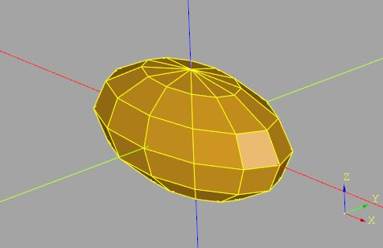

# `cqmore.matrix`

Provide the `Matrix3D` class and functions for performing matrix and vector operations. Here's an example to build a translation matrix for translating a point.

    from cqmore.matrix import translation

    point = (10, 10, 10)
    m = translation((10, 0, 0))    # return a Matrix3D instance
    new_point = m.transform(point) # (20, 10, 10)

`Matrix3D` supports matrix multiplication. You can combine multiple transformations in a single matrix. Say you have a point (10, 0, 0) and you want to translate it by (5, 0, 0) and then rotate it around the z-axis by 45 degrees. You can do it like:

    from cqmore.matrix import translation, rotationZ

    point = (10, 0, 0)
    m = rotationZ(45) @ translation((5, 0, 0))
    new_point = m.transform(point) 

The right-most matrix is first multiplied with the point so you should read the multiplications from right to left. 

## Classes

 Signature | Description
--|--
[`Matrix3D(m)`](matrix.md#matrix3d) | Create a matrix from an array-like object.

## `Matrix3D` Operations

 Signature | Description
--|--
[`transform(point)`](matrix.md#transform) | Use the current matrix to transform a point.
[`transformAll(points)`](matrix.md#transformall) | Use the current matrix to transform a list of points.

## Functions

 Signature | Description
--|--
[`identity()`](matrix.md#identity) | Create an identity matrix.
[`scaling(v)`](matrix.md#scaling) | Create a scaling matrix.
[`translation(v)`](matrix.md#translation) | Create a translation matrix.
`mirror(v)` | Create a mirror matrix.
`rotationX(angle)` | Create a rotation matrix around the x-axis.
`rotationY(angle)` | Create a rotation matrix around the y-axis.
`rotationZ(angle)` | Create a rotation matrix around the z-axis.
`rotation(direction, angle)` | Create a rotation matrix around the given direction.

----

# `Matrix3D`

Create a matrix from an array-like object.

## Parameters

- `m`: an array-like object.

## Examples 

    from cqmore.matrix import Matrix3D

    v = (5, 5, 5)

    # Create a translation matrix
    translation = Matrix3D([
        [1, 0, 0, v[0]],
        [0, 1, 0, v[1]],
        [0, 0, 1, v[2]],
        [0, 0, 0, 1]
    ])

# `transform`

Use the current matrix to transform a point.

## Parameters

- `point`: the point to transform.

## Examples 

    from cqmore.matrix import Matrix3D

    translation = Matrix3D([
        [1, 0, 0, 5],
        [0, 1, 0, 5],
        [0, 0, 1, 5],
        [0, 0, 0, 1]
    ])

    point = (10, 20, 30)
    translated = translation.transform(point) # (15, 25, 35)

# `transformAll`

Use the current matrix to transform a list of points.

## Parameters

- `points`: a list of points to transform.

## Examples 

    from cqmore.matrix import Matrix3D

    translation = Matrix3D([
        [1, 0, 0, 5],
        [0, 1, 0, 5],
        [0, 0, 1, 5],
        [0, 0, 0, 1]
    ])

    points = [(10, 20, 30), (0, 0, 0), (-10, -20, -30)]

    # ((15, 25, 35), (5, 5, 5), (-5, -15, -25))
    translated = translation.transformAll(points) 

# `identity`

Create an identity matrix.

## Examples 

    from cqmore.matrix import identity

    m = identity()

# `scaling`

Create a scaling matrix.

## Parameters

- `v`: scaling vector.

## Examples 

    from cqmore.matrix import scaling
    from cqmore.polyhedron import uvSphere
    from cqmore import Workplane

    sphere = uvSphere(1, widthSegments = 12, heightSegments = 6)

    m = scaling((2, 1, 1)) 
    scaled_points = m.transformAll(sphere.points)

    r = Workplane().polyhedron(scaled_points, sphere.faces)

# `translation`

Create a translation matrix.

## Parameters

- `v`: translation vector.

## Examples 

    from cqmore.matrix import scaling, translation
    from cqmore.polyhedron import uvSphere
    from cqmore import Workplane

    sphere = uvSphere(1, widthSegments = 12, heightSegments = 6)

    r1 = Workplane().polyhedron(*sphere)
    s = scaling((2, 2, 2)) 
    t = translation((3, 0, 0))

    transformed_pts = (t @ s).transformAll(sphere.points)
    r2 = Workplane().polyhedron(transformed_pts, sphere.faces)

