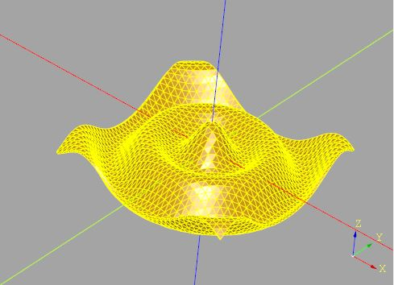

# `cqmore.polyhedron`

Provide the `Polyhedron` class and functions for creating `Polyhedron` instances. The `Polyhedron` class defines `points` and `faces` attributes. Here is a way to use them.

    from cqmore.polyhedron import uvSphere
    from cqmore import Workplane

    sphere = (Workplane()
                .polyhedron(*uvSphere(radius = 10, rings = 5))
             )

## Classes

 Signature | Description
--|--
[`Polyhedron(points,faces)`](polyhedron.md#polyhedron) | Define `points` and `faces` attributes.

## Functions

 Signature | Description
--|--
[`uvSphere(radius,[rings])`](polyhedron.md#uvsphere) | Create a UV sphere.
[`gridSurface(points[,thickness])`](polyhedron.md#gridSurface) | Create a surface with a coordinate meshgrid.
[`hull(points)`](polyhedron.md#hull) | Create a convex hull through the provided points. 

----

# `Polyhedron`

Define a polyhedron.

## Parameters

- `points`: points of vertices. 
- `faces`: face indices.

## Examples     

    from cqmore.polyhedron import Polyhedron
    from cqmore import Workplane

    points = (
        (5, -5, -5), (-5, 5, -5), (5, 5, 5), (-5, -5, 5)
    )

    faces = (
        (0, 1, 2), (0, 3, 1), (1, 3, 2), (0, 2, 3)
    )

    tetrahedron = Polyhedron(points, faces)
    tetrahedrons = (Workplane()
                       .rect(15, 15, forConstruction = True)
                       .vertices()
                        .polyhedron(*tetrahedron)
                   )   

# `uvSphere`

Create a UV sphere.

## Parameters

- `radius`: sphere radius. 
- `rings = 2`: number of horizontal segments.

## Examples 

    from cqmore.polyhedron import uvSphere
    from cqmore import Workplane

    sphere = (Workplane()
                .polyhedron(*uvSphere(radius = 10, rings = 5))
             )

# `gridSurface`

Create a surface with a coordinate meshgrid.

## Parameters

- `points`: a coordinate meshgrid.
- `thickness = 0`: the amount of being thick (return 2D surface if 0).

## Examples 

    from math import sqrt, cos, radians
    from cqmore import Workplane
    from cqmore.polyhedron import gridSurface

    def ripple(x, y):
        n = radians(sqrt(x ** 2 + y ** 2))
        return (x, y, 30 * (cos(n) + cos(3 * n)))

    min_value = -200
    max_value = 200
    step = 10
    thickness = 5

    points = [[
            ripple(x, y) 
        for x in range(min_value, max_value, step)
    ] for y in range(min_value, max_value, step)]

    sf = Workplane().polyhedron(*gridSurface(points, thickness))

# `hull`

Create a convex hull through the provided points. 

## Parameters

- `points`: a list of 3D points. 

## Examples 

    from cqmore import Workplane
    from cqmore.polyhedron import hull

    points = (
        (50, 50, 50),
        (50, 50, 0),
        (-50, 50, 0),
        (-50, -50, 0),
        (50, -50, 0),
        (0, 0, 50),
        (0, 0, -50)
    )

    convex_hull = Workplane().polyhedron(*hull(points))

